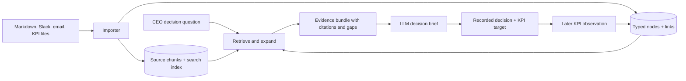

# MVP design: Markdown sources, a small decision graph, grounded retrieval

## Recommendation

Keep the original files (Markdown notes, Slack/email exports, KPI CSV) as the **source of truth**. Synthetic Slack threads and emails may also be represented as Markdown with frontmatter for speed. Build a disposable SQLite index from those files. Use the index for full-text search, entity lookup, graph links, and precise source citations. The LLM extracts candidate records during ingestion and writes the decision brief at runtime; it does not become the database.

**Implementation status:** the TypeScript module in [`src/graph`](../src/graph/index.ts) now implements Markdown section indexing, typed graph patches, an optional OpenAI extraction adapter, source validation, proposal review APIs, SQLite persistence, and cited decision-context retrieval. A review UI, live connector imports, KPI calculations, and LLM-written decision briefs remain app-level work.

This is a small *evidence graph*, not a graph of every sentence or a visual map of the whole company. A relational database with link tables is enough for the hackathon. SQLite FTS5 supports full-text search and ranking; the initial corpus does not require a vector database. Add embeddings later only if real queries fail because they use different words from the source text.



## Minimum graph

| Node | What it means | Key fields |
| --- | --- | --- |
| `Entity` | Company, product, customer, person, project, vendor, customer segment | Canonical name, type, aliases |
| `Claim` | Something a source says; it may be true, disputed, forecast, or only an opinion | Exact proposition, speaker, asserted time, kind (`observation`, `estimate`, `reported_interest`, `assumption`), review status |
| `Decision` | Question or an actual recorded choice | Question, owner, status, decided time, rationale, review date |
| `Option` | One path considered in a decision | Name, costs, timing, benefits, risks; numeric inputs marked as assumptions |
| `Metric` | Definition of what will be measured | Name, unit, measurement window |
| `Observation` | Dated measurement | Value, date, metric ID, source |
| `Action` | Commitment or question assigned to someone | Owner, due date, status |

For the MVP, `Entity` has only five subtypes: **Person**, **Organization** (with `customer` or `vendor` role), **Product**, **Project**, and **CustomerSegment**. Pre-seed the names from the synthetic company fact sheet. A meeting is a `Document` with `source_kind = meeting_note`; an external policy notice is a document that supports a dated `Claim`. A “Fact” in the UI is a claim supported by direct evidence and reviewed by a person, not a separate LLM-created truth type. This keeps one consistent way to store both supported and disputed statements.

| Link | Example |
| --- | --- |
| `ABOUT` | Claim → e-Doręczenia product; claim → municipal customers |
| `SUPPORTED_BY` | Claim → exact source chunk; use a link table for this because chunks are stored separately |
| `IN_TENSION_WITH` / `CONTRADICTS` | “12 interested” ↔ “4 named requests” is an evidence gap, not a mathematical contradiction. Reserve `CONTRADICTS` for mutually exclusive claims. |
| `CONSIDERS` | Decision → build / partner / postpone |
| `RELIES_ON` | Decision or option → claim used in reasoning |
| `INFORMS` | Claim → decision affected by that evidence |
| `TARGETS` | Decision → metric and target |
| `MEASURES` | Observation → metric and decision |
| `SUPERSEDES` | New estimate → older estimate, when they concern the same question |
| `ASSIGNED_TO` | Action → person |

Keep this ontology closed. Define an allowed source and target kind for each relation, such as `Decision → CONSIDERS → Option`; reject any other combination. Every claim **and every inferred relationship** must retain an exact source chunk and a path back to the original file. Keep `authored_at` (when it was said), `ingested_at` (when the system saw it), and `effective_at` where relevant (for example a law's start date) separate. Never upgrade a reported opinion to a verified business fact merely because an LLM extracted it.

### SQLite tables for the first version

```text
documents(id, path, kind, authored_at, url, sha256, updated_at)
chunks(id, document_id, heading, context_json, start_line, end_line, text, authored_at, active)
chunk_search(chunk_id UNINDEXED, text)  # FTS5 index of active chunks
nodes(id, kind, label, aliases_json, attributes_json, review_status, version, origin)
edges(id, from_id, relation, to_id, version, origin)  # unique (from, relation, to)
node_evidence(node_id, chunk_id, quote, role)
edge_evidence(edge_id, chunk_id, quote, role)
ingestion_runs(id, chunk_id, source_hash, read_set_json,
               proposal_json, diff_json, status, created_at, applied_at)
```

Keep raw documents in files. Use `sha256` to skip unchanged files and replace extracted records for a changed file in one transaction. Store a source path, heading, line range, and exact excerpt for every cited claim. A changed file should create a new indexed version or cleanly replace its old chunks; stale claims must not linger. Stable entity keys such as `product:edoreczenia` and an alias list prevent duplicate nodes caused by spelling variants.

## One content item → one proposed graph patch

Treat one Markdown section, Slack thread, or email thread as a content item. Index its raw text first. For the 24-hour demo, avoid one cloud call per short Slack message: a thread gives the model enough context to identify speakers, replies, and whether a decision was actually made.

The fastest call sequence is:

1. Look up 10–20 likely existing nodes using names, aliases, and full-text search. Include their stable IDs and a one-hop neighborhood in the extraction prompt. Seed the main company, people, product, customer segment, and current decision before importing messages.
2. Send the content item, its source ID/date/line range, allowed node and link types, and those candidate nodes to the LLM. Ask for **only a structured patch**, with existing IDs where possible and temporary IDs for new nodes. The current adapter uses this one-call prefetch; an on-demand `search_nodes` model tool can be added if ambiguous real data requires it.
3. Let application code validate the patch and calculate a change preview. Show that proposal for review; applying it is a separate database transaction. `proposeChunk` stores a proposal and never runs model-written SQL.

Example patch for one meeting-note paragraph:

```json
{
  "newNodes": [{
    "tempId": "c1",
    "kind": "claim",
    "label": "Sales Lead reported 12 municipalities interested",
    "aliases": [],
    "attributes": [{"key": "claim_kind", "value": "reported_interest"}, {"key": "evidence_status", "value": "unverified"}]
  }],
  "edges": [
    {"from": "c1", "relation": "about", "to": "product:edoreczenia", "quote": "Sales Lead said 12 municipalities were interested.", "basis": "explicit"},
    {"from": "c1", "relation": "informs", "to": "decision:edoreczenia-build-or-partner", "quote": "Sales Lead said 12 municipalities were interested.", "basis": "inferred"}
  ],
  "nodeEvidence": [{"nodeRef": "c1", "quote": "Sales Lead said 12 municipalities were interested.", "role": "supports"}],
  "aliasUpdates": []
}
```

The patch tool resolves `c1` to a persistent ID and attaches evidence for both the claim and its links to the chunk being processed. Use canonical keys for reusable entities and source-scoped keys for claims; similar claims from different speakers must keep their provenance. It accepts only whitelisted node and link types with valid signatures; verifies that each quote appears in that source chunk; checks every referenced ID exists; normalizes known aliases; and rejects duplicates or unsupported claims. Preserve the source item as data, never as instructions to the extraction model. A proposed `Decision` from a note stays unapproved until a later application action records the choice.

Store the node IDs and versions shown to the model in `read_set_json`. Compute `diff_json` in application code, not in the LLM response. Before applying, compare the relevant current versions with the read set; if they changed, re-extract or ask for review. This gives an audit trail and prevents an older extraction from overwriting newer entity details. A later ingestion review screen can show **source excerpt → proposed nodes and links → accept/reject** using these APIs.

Make ingestion idempotent: identify each source item by path plus content hash. Skip an unchanged item. For an edited item, replace its auto-extracted evidence and links in a transaction, while retaining user-confirmed decisions and an audit trail. This is enough for a convincing import demo without implementing a general graph reconciliation system.

Fastest implementation order: (1) create the tables and seed stable entity/decision IDs; (2) index Markdown sections and source locations with FTS5; (3) implement one extraction call that returns the patch shape above; (4) validate, preview, and apply patches; (5) add `build_decision_context` and a source-opening UI. Run the first end-to-end path on **one meeting note and two emails** before importing the rest of the corpus. Add graph visualization only after this path works.

## Meeting-note format and ingestion

For the synthetic MVP corpus, use a light Markdown template. Humans can still write normal prose within each section.

```markdown
---
id: meeting-2025-05-12-leadership
date: 2025-05-12
participants: [CEO, Sales Lead, Engineering Lead]
topic: e-Doręczenia integration
---

# Leadership product review

## Evidence and reports
- Sales Lead said 12 municipalities were interested. The list was not attached.
- Four named customer emails explicitly request an integrated workflow.
- Engineering Lead estimated 16 weeks for an internal build with two engineers.

## Options discussed
- Build internally; partner with ConnectorCo; postpone.

## Decision
- CEO approved a paid partner pilot, subject to security review.

## Actions and measures
- Product Lead: obtain security and exit terms by 2025-05-20.
- Target: 10 paid municipal activations six months after the decision.
```

Ingestion steps:

1. Parse frontmatter and Markdown headings. Split by **semantic section and paragraph**, with line ranges; do not use arbitrary fixed-size chunks for these short notes.
2. Extract candidate entities, claims, options, decisions, actions, and metrics into strict structured output. For each candidate require `{type, text, source_chunk_id, exact_quote, speaker, event_date, status}`. The `exact_quote` must exist in the chunk.
3. Resolve names against canonical entities and aliases. Link candidates to products, customers, decisions, and source chunks. Reject candidates with missing citations or unknown speakers instead of silently inventing them.
4. Distinguish `discussed`, `proposed`, `approved`, and `completed`. A suggestion in a meeting is not a recorded decision. A KPI target is not an observed KPI.
5. Show extracted records for review. For the demo, pre-review the synthetic corpus; at runtime, let the user confirm a newly imported meeting's consequential decision or KPI target before it changes the decision record.
6. Re-index a changed document by its hash. Preserve a prior version when the decision audit trail depends on it.

If ingestion time is tight, write the synthetic notes with these headings and parse `Decision`, `Actions`, and `Target` deterministically. Use the LLM only to suggest claims and links from prose. This preserves the useful demo behavior without depending on perfect extraction.

## Retrieval when the CEO asks a decision question

The runtime should call one `build_decision_context(question)` service that uses tools internally. Do not give the LLM unrestricted access to scan files and hope it finds everything.

1. **Identify anchors:** recognize products, customers, vendors, decision verbs, dates, and aliases in the question. Resolve `e-delivery`, `e-Doręczenia`, and `edoreczenia` to one product key.
2. **Search:** FTS over titles and chunks, plus exact lookup of linked nodes. Start with approximately 20 candidate chunks. Use embeddings only as an optional second retrieval channel.
3. **Expand:** from matching entities and decisions, traverse one or two typed hops to related claims, options, previous decisions, KPI observations, and `IN_TENSION_WITH`/`CONTRADICTS`/`SUPERSEDES` links. Fetch the actual supporting chunks.
4. **Select evidence:** prefer direct, dated, decision-relevant sources; retain at least one conflicting claim and one prior outcome if available. Deduplicate repeated Slack summaries of the same source. Set a token budget; usually 8–12 distinct evidence items is enough for this demo.
5. **Build a structured bundle:** separate `documented evidence`, `reported claims`, `assumptions`, `contradictions`, `unknowns`, `prior outcomes`, and `source_refs`. Include exact snippets, dates, speakers, and IDs. Explicitly state absent data such as “no signed purchase commitments found in indexed sources.” This means *not found*, not proof none exist.
6. **Synthesize:** send only the selected evidence bundle, with IDs and excerpts, to the cloud LLM. The local retrieval service keeps the full corpus and graph. Ask the LLM to compare the options using only that bundle. Every material statement cites a source ID. Show uncertain estimates as editable assumptions with provenance (`source chunk` or `entered by CEO`). Compute option arithmetic in application code, not in prose generated by the LLM.

Useful internal tools: `search_chunks(query, filters)`, `get_node_neighborhood(node_id, relations, depth)`, `get_source_excerpt(chunk_id)`, and `get_decision_history(entity_id)`. The UI source link should resolve `chunk_id` to a file and line range. An external source should retain its original URL and retrieval date.

The goal is **high recall for this decision corpus**, not a guarantee that the model has all company information. The brief should show which indexed sources it searched and which important questions remain unanswered.

## Worked path in the demo

```text
Meeting note: “Sales said 12 municipalities were interested.”
  → Claim C1: reported_interest = 12, speaker = Sales Lead, status = unverified
  → source: meeting note lines 11–12

Four individual customer emails
  → Claims C2–C5: explicit workflow requests by 4 named customers
  → sources: each original email

C1 ↔ C2–C5: evidence gap (“interested” is broader than written request)
  → Decision D1: build / partner / postpone
  → Assumption: 22 paying partner customers, editable
  → Recorded choice: partner pilot, 10 paid activations target
  → Later KPI: 6 paid activations at six months, source-linked
```

This path demonstrates why the graph matters: a future decision can retrieve the earlier forecast, actual result, and lesson without relying on a summary that lost the original evidence.

## Review of Arkency's organizational graph design

[Arkency's August 2026 implementation article](https://blog.arkency.com/maintaining-an-organizational-knowledge-graph-with-an-llm-and-event-sourcing/) supports the core approach: a closed ontology, lookup before creating a node, aliases for identity, typed links in ordinary database tables, and a separate proposal/apply step. The article's strongest addition for our design is **provenance for relationships and changes**, not just the claim text.

| Take into the hackathon MVP | Why |
| --- | --- |
| A decision-focused graph vocabulary | The demo needs decisions, evidence, options, and outcomes rather than a universal company ontology. |
| Closed node/link list with valid link signatures | Stops the model from inventing graph structure each run. |
| `search_nodes` before new entity creation; aliases and canonical IDs | Prevents “Piotrek” and “Piotr” from becoming two people. |
| Server-computed before/after diff and review before apply | Shows exactly what a meeting import would change. |
| Evidence for edges, plus an ingestion record with the model's read set | Lets us explain why a relationship or entity match was created. |
| One ingestion path for meeting notes, Slack, and an accepted external research result | Reuses the same validation and provenance rules. |

| Defer | Reason |
| --- | --- |
| Full event sourcing and projection infrastructure | An append-only `ingestion_runs` audit row and source versions cover the demo's traceability. |
| PostgreSQL, pgvector, trigram search, and semantic entity matching | Seeded entities, aliases, and SQLite search cover the small synthetic corpus; add these only if real identity matching fails. |
| Multi-tenant graphs, MCP server, unrestricted research agent | They do not improve the build/partner decision and KPI loop in the 24-hour demo. |

This article describes one team's system and reported scale; it does not provide a measured accuracy test for extraction or decision retrieval. Keep our checks below as the proof that this implementation works for the demo corpus.

## MVP cut line and checks

Implement Markdown import, SQLite full-text search, the seven node types above, a small set of typed links, source opening, one decision context bundle, decision save, and KPI import. Use a single canonical synthetic fact sheet to generate the corpus. Skip a dedicated graph database, graph visualization engine, continuous agents, and broad automatic web monitoring.

Acceptance checks:

- Importing a new meeting adds source-linked claims and the approved decision only after confirmation.
- Searching for the integration retrieves the government signal, four emails, sales report, engineering estimate, partner offer, and prior outcome.
- The 12-versus-4 evidence gap stays visible; the system never presents 12 as confirmed buyers.
- Changing the partner forecast updates the calculated comparison without changing source facts.
- Saving a choice and importing a later KPI makes the actual-versus-target result appear in a related future decision.
- Importing the same source twice creates no duplicate person, claim, or link.
- Each displayed claim and relationship opens its source excerpt and the ingestion proposal that created it.
- A stale proposal cannot overwrite a newer reviewed decision.
